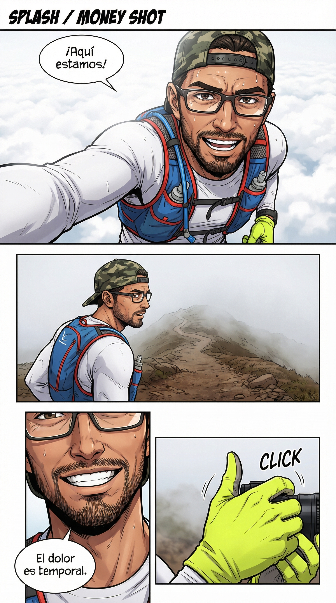

# MotionManga

MotionManga is a CLI tool that transforms your videos into a manga comic using the power of Google's Gemini 3 models.

## Features

*   **Automatic Video Optimization:** Resizes large videos (>10MB) for efficient uploading.
*   **Multimodal Story Generation:** Creates a coherent narrative based on your videos using `gemini-3-pro-preview`.
*   **AI Illustration:** Generates visually striking manga pages using `gemini-3-pro-image-preview`.

## Prerequisites

*   Python 3.10+
*   [uv](https://github.com/astral-sh/uv) (Recommended package manager)
*   A Google GenAI API Key with access to Gemini 3 models.

## Installation

1.  **Clone the repository (or download files):**
    Ensure you have `main.py`, `story.md`, and `comic.md` in your working directory.

2.  **Initialize and install dependencies:**
    ```bash
    uv init
    uv add google-genai python-dotenv typer rich imageio-ffmpeg
    ```

3.  **Configure Environment Variables:**
    Create a `.env` file in the project root and add your API Key:
    ```env
    GOOGLE_API_KEY=your_api_key_here
    ```

## Usage

Run the script passing up to 3 video files as arguments:

```bash
uv run main.py video1.mp4 video2.mp4 video3.mp4
```

### Configuration Files

*   **`story.md`**: Contains the system prompt and context for story generation. Edit this to change the tone or narrative style.
*   **`comic.md`**: Contains the style prompt for image generation. Adjust this to change the artistic style of the manga.

## Output

The script will generate the following files in the `output/` directory:

*   **`story.txt`**: The script of your manga, divided by pages.
*   **`page_1.png`, `page_2.png`, ...**: The generated images for each page of the story.

## Examples

### Generated Story Snippet
```text
--- PAGE_1 ---

**Source:** Video 1 (00:00s)
**Panel 1:** [Layout: Panoramic] [**Visual:** (square jaw, stubble beard, buzz cut, white tank top), standing alone in rain...] | **Balloon:** [Narration: "It all started here."]
```

### Generated Manga Page


## Notes

*   Videos larger than 10MB will be automatically resized to 720p height to optimize API usage.
*   Ensure your videos are clear and relevant to get the best results in the story.

## Limitations

*   **Video Count:** The tool supports a maximum of 3 input videos.
*   **Duration:** Successful tests have been conducted with videos up to 2 minutes long. Longer videos might exceed token limits or API timeouts.
